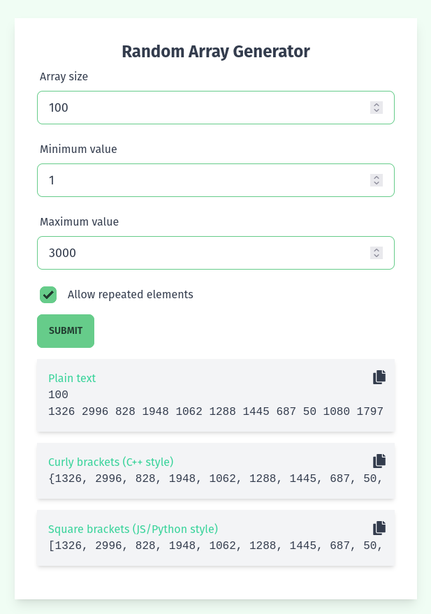

# Random Array Generator

A React web application that generates random numbers in the following formats:

**Plain text**

```
4
3 6 9 8
```

**C++ array**

```
{3, 6, 9, 8}
```

**JS/Python array**

```
[3, 6, 9, 8]
```



This project was bootstrapped with [Create React App](https://github.com/facebook/create-react-app).

## Run in development

```
yarn start
```

## Run in production

```
yarn build
```

See the section about [deployment](https://facebook.github.io/create-react-app/docs/deployment) for more information.
